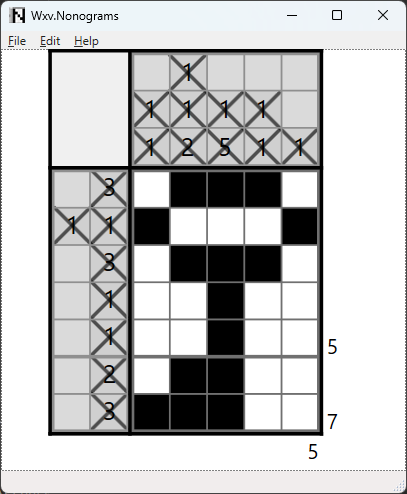

# Wxv.Nonograms

_Version 1.0.0_

Nonograms are picture logic puzzles which when solved reveal a hidden picture.  See also [Wikipedia](https://en.wikipedia.org/wiki/Nonogram).  This is a little windows application to play them.

I built this because I was a little frustrated with the limitations the otherwise excellent existing online web interfaces for this game.  It is heavily inspired by [www.nonograms.org](https://www.nonograms.org), but also has my own original contributions.  It's main extra features include:

- Lightweight UX, no web page or other extras to get in the way.
- Provides the dimension of the cells your drawing.
- Allows you to measure a dimension without drawing any cells.
- When you start drawing or measuring a row or column of cells, it won't draw outside that range (unless you press shift).  This prevents simple mistakes caused by clumsy hands. 
- Unlimited hints ( but i don't need that 😊 ).
- Undo and Redo.
- Remembers the puzzle you've worked on when you previously ran the application.

## Instructions

- `Left mouse button` click sets or clears a cell.  
- `Right mouse button` click marks or un-marks a cell as being unset
- `Middle mouse button` click measure a set of cells.
- Keep pressing the mouse button to draw or measure a range of cells.
- Hold `Shift` while pressing the mouse button if you want to draw or measure a block (not a column or row) of cells.
- The `Del` key clears the drawing 
- `Control+Z` undoes an operation
- `Control+Y` redoes an operation
- `Space` checks the picture for correctness or completeness.  Incorrect cells show as red.
- The `H` key provides a hint.  Hints show as green.  Press space to _complete_ the hint.
- Control+V will import a puzzle from one of the following sources:
  - A URL to a [www.nonograms.org](https://www.nonograms.org) black and white puzzle online e.g. https://www.nonograms.org/nonograms/i/1348
  - A URL to a [www.nonograms.org](https://www.nonograms.org) answer image online e.g. https://static.nonograms.org/files/nonograms/large/kotyonok3_12_1_1p.png
  - A solution image.  This must be a simple two color image.  This allows you to make and test your own nonogram puzzles and test them in this windows application.
  - _Note:_ Puzzles should be no smaller the 5 cells and no larger then 50 cells in width and height.

# Installation

- Prerequisites:
  - Windows 11 (10 and earlier versions will probably work too)
  - .NET 7 Desktop Runtime ( or later versions ), or any other .NET distribution that includes this e.g. the SDK.  https://dotnet.microsoft.com/en-us/download/dotnet/7.0
- Download the source and run the `Wxv.Nonograms.UX` project from the IDE or command line.  It needs .NET 7 and/or an IDE that supports it.
- _or_ download the release, unzip it somewhere, and run the `Wxv.Nonograms.UX.exe` application.  You will need the dotnet 8 or later runtime installed on your machine as well.
- _Note: The application saves the puzzle you worked on to the `~user\AppData\Local\Wxv.Nonograms.UX` folder.  Delete this folder manually if don't want it.  

## Notes

- This is just a personal hobby project.  No warranty provided.  There are probably lots of things to fix or improve.  Feel free to fork.

## Acknowledgements 

- Thanks to [www.nonograms.org](https://www.nonograms.org) which provide a really excellent web interface to play this game.
